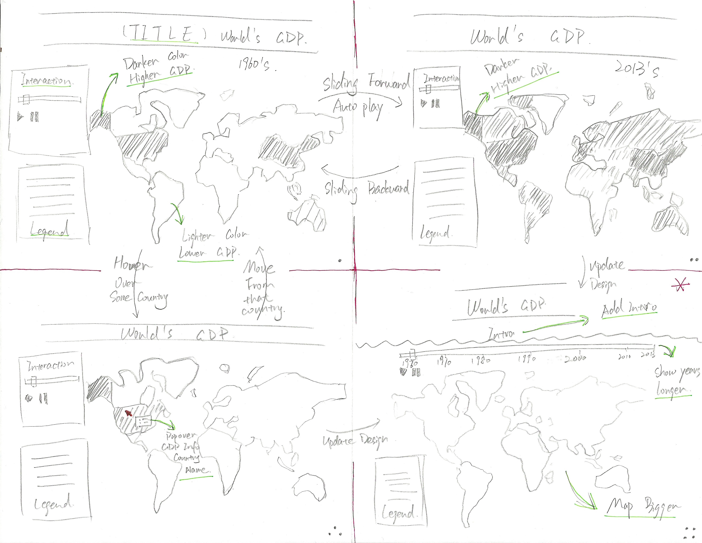

# a3-yx1992-Heyl-xiaoyiz
===============

## Team Members

1. Xin Yang yx1992@uw.edu
2. Yanling He Heyl@uw.edu
3. Xiaoyi Zhang xiaoyiz@uw.edu

## Project Name

World's GDP from 1960 to 2013

### Data set

World Development Indicators from The World Bank: http://data.worldbank.org/data-catalog/world-development-indicators

### Description

It is an interactive data visualization that shows the world's GDP (Gross Domestic Product) in current US$ from 1960 to 2013 on a world map. It is developed for showing and learning world's economy development in the recent half century. 

Map: The data set contains countries' GDP information from 1960 to 2013, in order to show the GDP info for different countries a world map is a good choice, so GDP info can be mapped to each countries. Map also contains geography information, users can see the economy development differences between different continents or different areas, either close to the sea or in the middle of the main land.

Color: The GDP values vary from less than 1 billion to more than 100,000 billion, so we separate GDP into 12 different ranges and us Sequential color scale to encode this quantitative data info. To avoid the color distraction of the data visualization we choose one constrained hue, and vary luminance to represent the data. Darker color means higher GDP, lighter color means lower GDP, so users can see the increment as the time goes on. For color harmony we choose light orange-red, so it won't be too bright and match the whole page design. Color encoding info are labeled on the left bottom to allow user known the representation of each color. When mouse over each country we choose to use more brighter orange color to highlight the country to bring more attention to the users.

Space: There is a title and brief introduction on the top of our data visualization to give user a brief introduction about what this software about and how to use it. Following the introduction, there is the interactive part with a slider on the top, it brings user attention to play with it. Underneath the slider bar we list the years, so when user sliding the slider or using auto play, we will know which year the map showing. Map is the major data visualization part, so we set it large but can be fit into a normal laptop screen, so user can view the whole map without scrolling up and down. On the left bottom there is a color encode information, if user wants to know the detail they can view the information there. When hovering over the country, a detail popover window shows up with country's name and DGP data, it shows nearby the mouse which allows user view the mouse movement and these data at the same time.

Interaction:

Slider: Sliding the slider block or using auto play mode user can view each years' world GDP map from 1960 to 2013. This allows user to either view particular year they interested to view the economy development changes over the years.

Selection: When hovering over a country on the map that country will be highlighted and country's name and its GDP detail will popover. This give more detail information for the users who wants to learn more about specific country or GDP amount.

## Running Instructions

Access our visualization at http://xiaoyizhang.me/512/

OR

Clone the repo, run "python -m SimpleHTTPServer 8080" in the terminal under the repo directory.

Open browser and navigate to http://localhost:8080

## Story Board

Scene 1: The title is on the top of the whole visualization. Below the title, we designed control panel and legend on the left using about 1/4 - 1/3 space, map start with the 1960's world GDP information on the right with about 2/3 - 3/4 space. Darker color region on the map means higher GDP. Control panel contains a slider, a play button and a pause button.

Scene 2: When user hit play button, the map will update from the start year to the end year with each year's GDP data. If user hit pause button, the map will stop at that current year. User can also slide the slider control block to navigate to their interested year.

Scene 3: When the map is not in the auto play mode and the mouse hover over any country, the country will be highlighted with a brighter color. A popover window shows up near the mouse showing country's name and that country's GDP detail of current year.

Scene 4: After implementing some features, we realized if we put the control panel on the left it will be hard to show year information and hard to control, so we move it to the top to increase the slider width and maximum the map size. We also add some introduction for user to learn about this visualization software.

### Changes between Storyboard and the Final Implementation

During the implementation we found our initial design that slider control panel on the left top will be too short to showing the year information and for user to slide, so we moved it to the top above the map. In this case we can show more year data information. It will also draw user's attention to let them start with playing with it.

There are some spaces on the right bottom of the map, so we put color encoding information there and maximum the map space to highlight the data visualization part.

We also add an introduction about this data visualization, data set and how to use it to guide user how to play with it.

## Development Process
Firstly, we browsed the available data sets and searched for interesting ones. For our interested data sets we try to come up a design with it and see if it works well. We select World Bank data sets, since we all interested in knowing about how the world's economy developed among the countries. Xin processed the data to our desired data format. Based on the data selected, we design an interactive data visualization story board. Basically, it is an intractable world map showing world's GDP. Xiaoyi implement the map interaction function. After we got the interactive map works, Yanling changed the webpage and detail design, and write the writeup. 

Yanling He: Design the page layout, draw story board and writeup

Xiaoyi Zhang: Implement interactive map with sliding and hovering functions

Xin Yang: Found data set and processing data

We discussed about data set selection and data visualization design for couple days, each day about 30 min discussion. Then for the full implementation we used about 2 days. Selecting data and thinking about the design cost some time, also searching the desired tools and looking the documentation costs most time.
